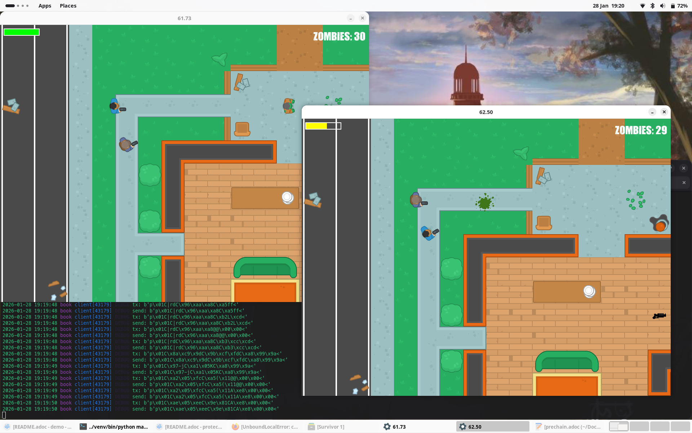

= Protecc!

multiplayer pygame with lobbies.

WARNING:: early WIP, idk Python

.Requirements
* allow reconnect
** if non-temporary disconnect: pass resources to remaining user
** do not rely on IP (e.g. train hotspot) for id
* allow for high delay

.todo
* implement coop tower-defense style game
* encryption
* UDP? IPv6?
* keepalive / ping, see builtin python?

.status:
* player movement synced, worlds are *completely* unsynced :)

.original game (without multiplayer):
* youtube: https://www.youtube.com/watch?v=3UxnelT9aCo&list=PLsk-HSGFjnaGQq7ybM8Lgkh5EMxUWPm2i[Tile-based game Part 1: Setting up]
* github: https://github.com/kidscancode/pygame_tutorials[kidscancode/pygame_tutorials]
* current modifications:
** added link:server.py[], link:client.py[]
** updated main game loop to consider incoming packets

.graphics:
* https://kenney.nl/assets/top-down-shooter (CC0)

.run the game
[source,shell]
----
$ python server.py

# positional arguments: nick lobby
$ python main.py nick 123
$ python main.py clark 123
----

== Protocol
=== Setup
----
client: (nick-length)(nick)
client: (lobby-id) # unsigned char
server: (player-id) # unsigned char
----

=== Commands (struct packing)
----
client: p(pid)(x)(y)(rot)(health) # !cBfffB
----

== Arch setup
[source,shell]
----
# setup venv (python-pygame-ce seems broken)
$ ---

# server connection test
$ sudo pacman -S socat
$ socat - TCP4:localhost:3579
----
